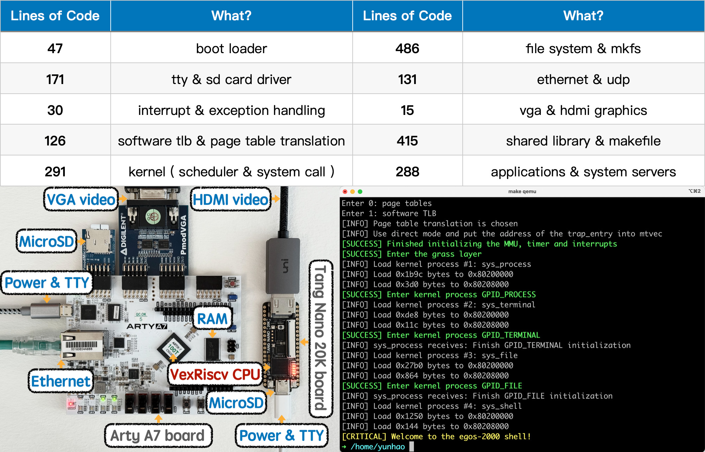

## Vision

This project's vision is to help **every** student read **all** the code of a teaching operating system.

With only **2000** lines of code, egos-2000 implements every component of an operating system for education. 
It can run on RISC-V boards and the QEMU software emulator.



```shell
# The cloc utility is used to count the lines of code.
> cloc egos-2000 --exclude-ext=md,txt,toml,json  # excluding text files
...
github.com/AlDanial/cloc v 1.94  T=0.05 s (949.3 files/s, 62349.4 lines/s)
-------------------------------------------------------------------------------
Language                     files          blank        comment           code
-------------------------------------------------------------------------------
C                               30            405            583           1602
C/C++ Header                     9             62            104            255
Assembly                         3             14             47             88
make                             1             16              8             55
-------------------------------------------------------------------------------
SUM:                            43            497            742           2000 (exactly!)
-------------------------------------------------------------------------------
```

## Earth and Grass Operating System

The **egos** part of egos-2000 is named after its three-layer architecture.

* The **earth layer** implements hardware-specific abstractions.
    * tty and disk device interface
    * timer and memory management interface
* The **grass layer** implements hardware-independent abstractions.
    * process control block and system call interface
* The **application layer** implements file system, shell and user commands.

The definitions of `struct earth` and `struct grass` in header file [egos.h](library/egos.h) specify the layer interface.
Please read [USAGES.md](USAGES.md) for running egos-2000 and
the [instruction set manual](https://riscv.org/wp-content/uploads/2017/05/riscv-privileged-v1.10.pdf) for the RISC-V privileged ISA.

## Acknowledgements

Many thanks to Meta for a [Facebook fellowship](https://research.facebook.com/blog/2021/4/announcing-the-recipients-of-the-2021-facebook-fellowship-awards/).
Many thanks to [Robbert van Renesse](https://www.cs.cornell.edu/home/rvr/), [Lorenzo Alvisi](https://www.cs.cornell.edu/lorenzo/), [Shan Lu](https://people.cs.uchicago.edu/~shanlu/), [Hakim Weatherspoon](https://www.cs.cornell.edu/~hweather/) and [Christopher Batten](https://www.csl.cornell.edu/~cbatten/) for their support.
Many thanks to all the [CS5411/4411](https://www.cs.cornell.edu/courses/cs4411/2022fa/schedule/) students at Cornell University over the years for helping improve this course.
Many thanks to [Cheng Tan](https://naizhengtan.github.io/) for providing valuable feedback and using egos-2000 in [CS6640 at Northeastern University](https://naizhengtan.github.io/23fall/).
Many thanks to [Brandon Fusi](https://www.linkedin.com/in/brandon-cheo-fusi-b94b1a171/) for [porting to the Allwinner's D1 chip](https://github.com/cheofusi/egos-2000-d1) using Sipeed's Lichee RV64 compute module.

For any questions, please contact [Yunhao Zhang](https://dolobyte.net/).
